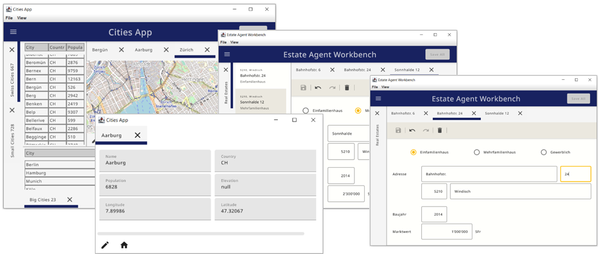
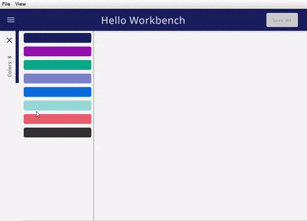

# ComposeWorkbench
Compose desktop library to build large Applications by combining existing Modules.



# What is a ComposeWorkbench
The ComposeWorkbench provides common application structures to custom modules. It supports two types of modules, explorers and editors. Once embedded in the ComposeWorkbench these modules can be dragged and dropped and the window management is taken care of. There is also support for custom commands and a messaging system that allows communication between the individual modules.

Explorer: An Explorer is a module who's main purpose is to display data. For example: a list of customers or products.

Editor: An Editor is a module who's main purpose is to edit a given data record. For example a single customer or product.

One major goal of this project is to allow Editor and Explorer implementations which are completely ignorant of each other. The only interface between them is a Type (String, like "Product" or "Customer") an ID (Int) which can be an id from a DB but also something as simple as an index from a publicly accessible list.

# Implementation
## Gradle
## Maven
# Usage
Check the \examples directory for examples on how to use ComposeWorkbench

To create a ComposeWorkbench app start wit an instance of a Workbench
``
val workbench: Workbench = Workbench("Hello Workbench")
``

### Register Modules
Editors and Explorers must be registered before they can be used (requested). The two main attributes in the registration are the content and the key. The content is the actual composable code (View) of the Module the key defines the type of data the Module can handle. By registering Editors and Explorers you tell the ComposeWorkbench which Types of Data are supported and how they can be explored and edited.

Use the workbench to register editors and explorers by calling the exposed functions.

#### Register Explorer
```kotlin
Workbench.registerExplorer<C>
```
Register an Explorer with the following arguments:
- C: Any - controller used in view to manage and display data
- type: String - the type of Data handled by this Module 
- title: (C) -> String - the display title of the explorer
- init: (C, MQClient) -> Unit - initialize messaging
- explorerView: @Composable(C) -> Unit - displayable content
```kotlin
     workbench.registerExplorer<List<Color>>(
        type = COLORS,
        title = { colors -> "Colors: ${colors.size}" },
    ) { colors ->
        Column {
            colors.forEachIndexed { i, c ->
                Card (
                    modifier = Modifier.padding(5.dp).height(25.dp).fillMaxWidth(),
                    backgroundColor = c,
                    onClick = { workbench.requestEditor(
                        type = COLOR,
                        id = i
                    ) }
                ) { }
            }
        }
    }
```
#### Register Editor
```kotlin
Workbench.registerEditor<C>
```
Register and Editor with the following arguments:
- C: Any - controller used in view to manage and display data
- type: String - the type of Data handled by this Module
- title: (C) -> String - the display title of the editor
- initController: (Int, MQClient) -> C - initialize a controller for the given data id and setup messaging
- icon: ImageVector - icon used for the editor (Optional)
- onSave: (C, MQClient) -> ActionResult - callback when saving the editor (Optional)
- editorView: @Composable(C) -> Unit - displayable content
```kotlin
    workbench.registerEditor<RgbController>(
        type = COLOR,
        title = { it.rgbState.title() },
        initController =  {i, mqtt -> RgbController(i, repository[i]){mqtt.publishUnsaved(COLOR, i)} },
        icon = Icons.Filled.Edit,
        onSave = { c, _ ->
            repository[c.rgbState.index] = Color(c.rgbState.r, c.rgbState.g, c.rgbState.b, 1f)
            success()
        }
    ){
        RgbEditorUi(it)
    }
```

#### OnSave
Saving an Editor will publish a message even if the callback is not specified. The onSave callback requires an ActionResult as return value. This ActionResult has a success flag which is a Boolean and a message. Use the predefined functions success() and failure(msg: String). The current action will be aborted should the returned ActionResults success flag be false. OnSave is called whenever Save All is executed or the Editor has unsaved state and is closed: Use this for validation or to execute additional actions or custom messages

### Request Modules
Once a Module is registered it can be requested. Explorers and Editors can be requested multiple times. An Explorer for example can be requested with different data subsets, like one explorer for employees grouped by country. It is also possible to have one Explorer for Lists which can handle all needed Data. Editors are requested whenever a data record needs editing.
Use the workbench to request editors and explorers by calling the exposed functions.

#### Request Explorer
```kotlin
Workbench.requestExplorer<C>
```
Request an Explorer with the following arguments:
- type: String - the type of Data for which an Explorer is requested
- c: C - controller used in view to manage and display data
- listed: boolean - defines if explorer is added to menu and can be reopened (Optional)
- location: ExplorerLocation - the location for this Explorer (Optional)
- shown: boolean - defines if the explorer is shown when starting the Workbench (Optional)
```kotlin
    workbench.requestExplorer<List<Color>>(
        type = COLORS,
        c = colors, 
        listed = true
    )
``` 
#### Request Editor
```kotlin
Workbench.requestEditor<C>
```
Request an Editor with the following arguments:
- type: String -
- id: Int -
```kotlin
    workbench.requestEditor(
        type = COLOR,
        id = i
    )
```

The most common use case to request Editors is when clicking on and item in the Explorer. An Editor for a given id and type can only be requested once. Should the Editor be requested again the workbench is simply selecting the already displayed Editor.
There can be multiple Editors for the same type. The location of a city for example can be edited by providing a set of coordinates but also by selecting a location on a Map.
If there are multiple editors for the same type the Workbench is defaulting to the Editor which was registered first, and the user can then switch between the available Editors.



Since each Editor can have its own controller and internal datastructures changes must be saved or discarded before switching between Editors.

### Messaging
Most of the provided callbacks grant access to the Workbench internal Mq Client. This is implemented with an embedded version of a MQTT Broker (https://github.com/hivemq/hivemq-community-edition). This Mq Client enables the Modules to communicate with each other and the Workbench. 
Use the init callback on the Explorer and the initController callback on the Editor registration to initialize message subscriptions.

#### Workbench specific Messages

*Unsaved Changes*

To enable the Workbench's Save Button and all its features the Editor must inform the Workbench about unsaved changes. 
```kotlin
 mqtt.publishUnsaved(type = COLOR, id = i)
 ```

*Subscribe for any Editor updates*

On the other side a custom module can subscribe for updates of Editors. For example to reload the City data from database in the Explorer if the Editor was Closed or Saved.
```kotlin
mqtt.subscribeForUpdates("City") { _, updateType ->
    if (updateType == UpdateType.SAVED || updateType == UpdateType.CLOSED) controller.reload()
}
```
Following update types for Editor are available: CREATED, SAVED, UNSAVED, CLOSED, SELECTED, OTHER

#### Custom Messages

*Publish to custom Topic*

For example, we want to share changes in a City Editor with an Explorer where Cities are shown.
Our Topic publishes the change of a field (e.g. Name of the City) with the new value from an Editor.
```kotlin
mqtt.publish("my-city-app/city/$id/$field", value)
```

*Subscribe for custom Topic*

On the Explorer we subscribe for our custom Topic with a MQ multilevel wildcard, to receive changes from any Editor who publishes to this topic.
The subscription provides a callback, where the published topic and it's send message are passed as arguments.
```kotlin
mqtt.subscribe("my-city-app/city/#") { topic, msg ->
    val topicSplit = topic.split("/")
    if (topicSplit.size == 4) {
        val id = topicSplit[2].toInt()
        val field = topicSplit[3]
        controller.update(id, field, value)
    }
}
```

## Design guide

### Explorer
- Keep your Explorer read only.
- Keep requesting of editors consistent (single click or double click)

### Editor
- When programming an Editor don't add a "Save" Button to the Editor itself use the Workbench internal save mechanism instead.
- Publish changes using the publishUnsaved function on the MqClient whenever the Editors state is changed

### General
Given by the way Explorer and Editors interact, a Type and an Id, the Compose Workbench supports  Modules which are completely ignorant of each other. To fully benefit from this it is recommenced to use one common Database for the Workbench and to use Database ids and Database Tables/Entities as types.
All Communication between Modules should only happen using the internal messaging.
