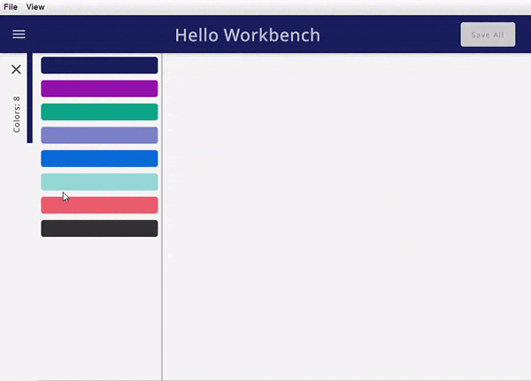

# ComposeWorkbench
Compose desktop library to build large Applications by combining existing Modules.
# What is a ComposeWorkbench
The ComposeWorkbench provides common application structures to custom modules. It supports two types of modules, explorers and editors. Once embedded in the ComposeWorkbench these modules can be dragged and dropped and the window management is taken care of. There is also support for custom commands and a messaging system that allows communication between the individual modules.

Explorer: An Explorer is a module who's main purpose is to display data. For example: a list of customers or products.

Editor: An Editor is a module who's main purpose is to edit a given data record. For example a single customer or product.

# Implementation
## Gradle
## Maven
# Usage
Check the \examples directory for examples on how to use ComposeWorkbench

To create a ComposeWorkbench app start wit an instance of a Workbench
``
val workbench: Workbench = Workbench("Hello Workbench")
``

### Register Modules
Editors and Explorers must be registered before they can be used (requested). The two main attributes in the registration are the content and the key. The content is the actual composable code of the Module the key defines the type of data the Module can handle. By registering Editors and Explorers you tell the ComposeWorkbench which Types of Data are supported and how they can be explored and edited.

Use the workbench to register editors and explorers by calling the exposed functions.

#### Register Explorer
```kotlin
Workbench.registerExplorer<C>
```
Register an Explorer with the following arguments:
- C: Any - controller used in view to manage and display data
- type: String - the type of Data handled by this Module 
- title: (C) -> String - the display title of the explorer
- init: (C, MQClient) -> Unit - initialize messaging
- explorerView: @Composable(C) -> Unit - displayable content
```kotlin
     workbench.registerExplorer<List<Color>>(
        type = COLORS,
        title = { colors -> "Colors: ${colors.size}" },
    ) { colors ->
        Column {
            colors.forEachIndexed { i, c ->
                Card (
                    modifier = Modifier.padding(5.dp).height(25.dp).fillMaxWidth(),
                    backgroundColor = c,
                    onClick = { workbench.requestEditor(
                        type = COLOR,
                        id = i
                    ) }
                ) { }
            }
        }
    }
```
#### Register Editor
```kotlin
Workbench.registerEditor<C>
```
Register and Editor with the following arguments:
- C: Any - controller used in view to manage and display data
- type: String - the type of Data handled by this Module
- title: (C) -> String - the display title of the editor
- initController: (Int, MQClient) -> C - initialize a controller for the given data id and setup messaging
- icon: ImageVector - icon used for the editor (Optional)
- onSave: (C, MQClient) -> ActionResult - callback when saving the editor (Optional)
- editorView: @Composable(C) -> Unit - displayable content
```kotlin
    workbench.registerEditor<RgbController>(
        type = COLOR,
        title = { it.rgbState.title() },
        initController =  {i, mqtt -> RgbController(i, repository[i]){mqtt.publishUnsaved(COLOR, i)} },
        icon = Icons.Filled.Edit,
        onSave = { c, _ ->
            repository[c.rgbState.index] = Color(c.rgbState.r, c.rgbState.g, c.rgbState.b, 1f)
            success()
        }
    ){
        RgbEditorUi(it)
    }
```

#### OnSave
Saving an Editor will publish a message even if the callback is not specified. The onSave callback requires an ActionResult as return value. This ActionResult has a success flag which is a Boolean and a message. Use the predefined functions success() and failure(msg: String). The current action will be aborted should the returned ActionResults success flag be false. OnSave is called whenever Save All is executed or the Editor has unsaved state and is closed: Use this for validation or to execute additional actions or custom messages

### Request Modules
Once a Module is registered it can be requested. Explorers and Editors can be requested multiple times. An Explorer for example can be requested with different data subsets, like one explorer for employees grouped by country. It is also possible to have one Explorer for Lists which can handle all needed Data. Editors are requested whenever a data record needs editing.
Use the workbench to request editors and explorers by calling the exposed functions.

#### Request Explorer
```kotlin
Workbench.requestExplorer<C>
```
Request an Explorer with the following arguments:
- type: String - the type of Data for which an Explorer is requested
- c: C - controller used in view to manage and display data
- listed: boolean - defines if explorer is added to menu and can be reopened (Optional)
- location: ExplorerLocation - the location for this Explorer (Optional)
- shown: boolean - defines if the explorer is shown when starting the Workbench (Optional)
```kotlin
    workbench.requestExplorer<List<Color>>(
        type = COLORS,
        c = colors, 
        listed = true
    )
``` 
#### Request Editor
```kotlin
Workbench.requestEditor<C>
```
Request an Editor with the following arguments:
- type: String -
- id: Int -
```kotlin
    workbench.requestEditor(
        type = COLOR,
        id = i
    )
```

The most common use case to request Editors is when clicking on and item in the Explorer. An Editor for a given id and type can only be requested once. Should the Editor be requested again the workbench is simply selecting the already displayed Editor.
There can be multiple Editors for the same Type. The location of a city for example can be edited by providing a set of coordinates but also by selecting a location on a Map.
If there are multiple editors for the Same Type the Workbench is defaulting to the Editor which was registered first, and the User can then switch between the available Editors.



### Commands
//TODO: is this a thing?

### Messaging
